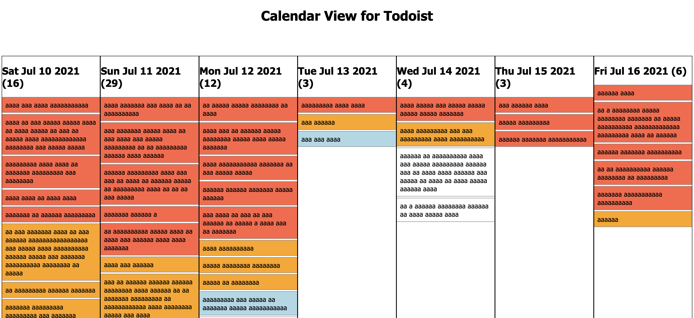

# calendar-view-todoist
A very quick and dirty calendar view for Todoist, since Todoist doesn't have one yet.

## Setup
Just download the code, open the html file, and enter your Todoist API token.
You can find this on the "Integrations" page of your account preferences.
