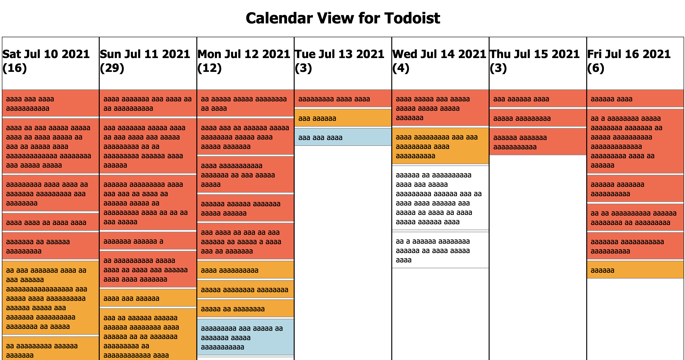

# calendar-view-todoist
A very quick and dirty calendar view for Todoist.

Thrown together one morning since Todoist doesn't have a calendar view like this yet.

## Setup
[To quickly try it out, you can use this link.](https://iancappellani.com/calendar-view-todoist/calendar.html)

Just enter your Todoist API token.
You can find this on the "Integrations" page of your account preferences.

If you want to download the code instead, just open the html file in a browser.
